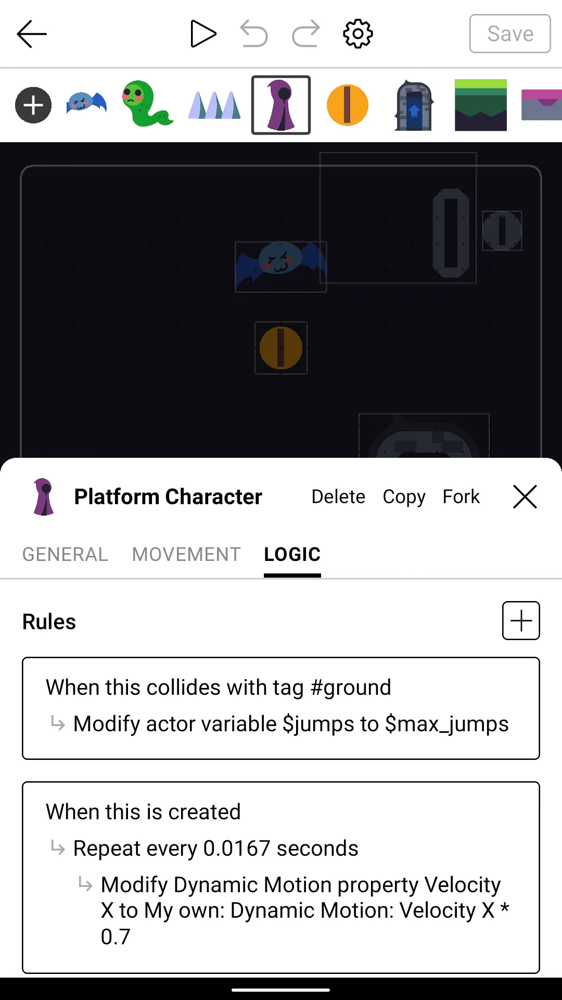
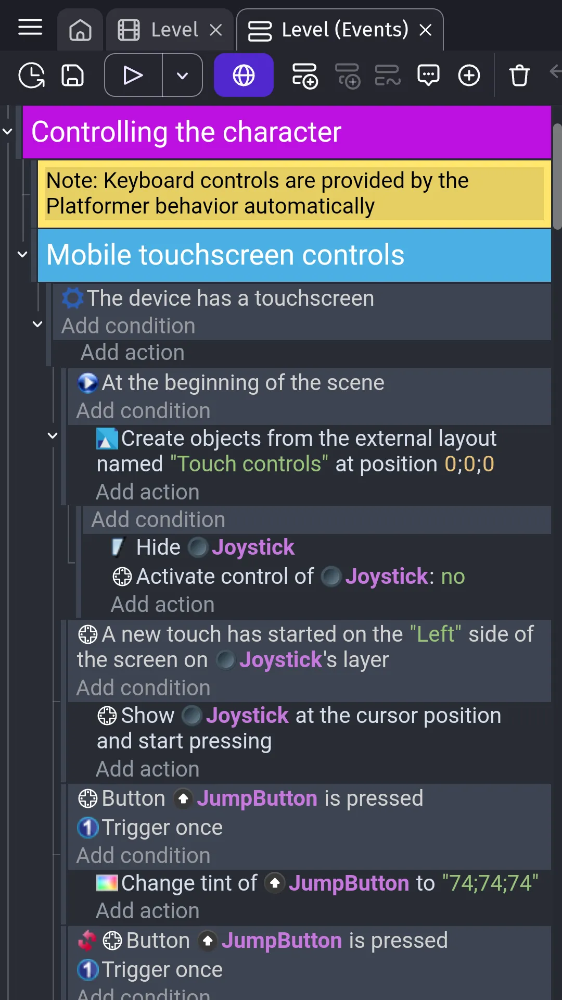
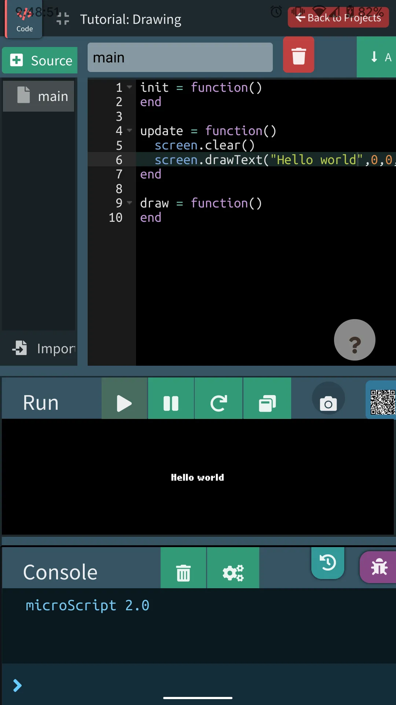
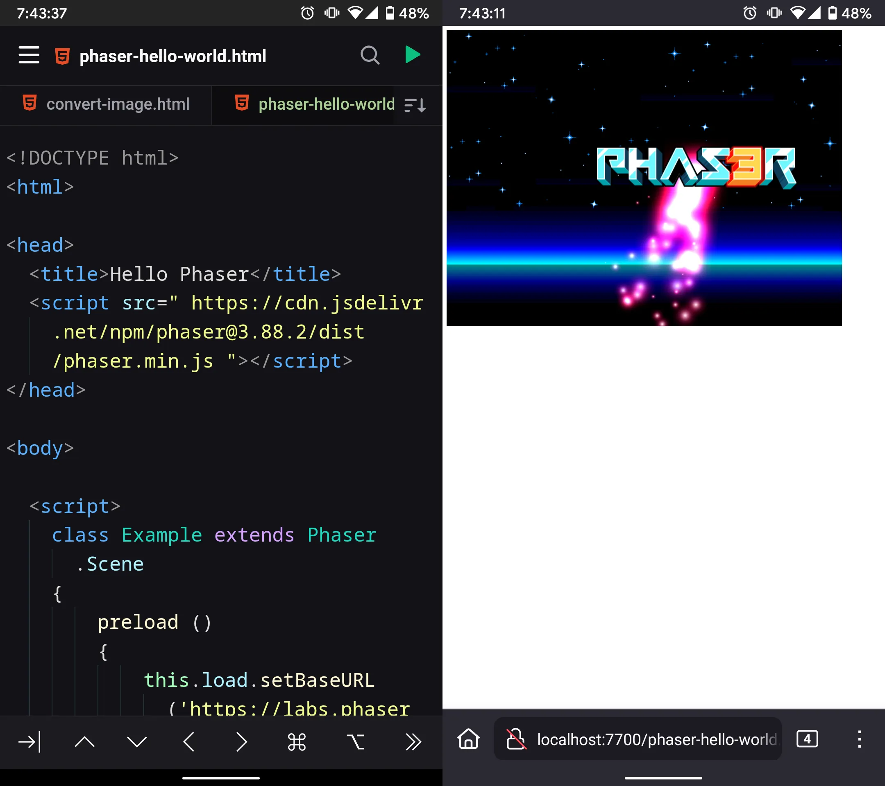
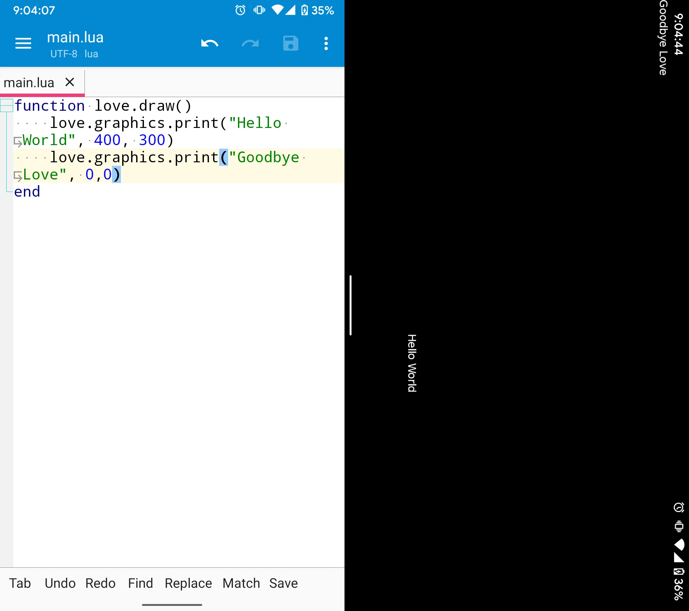
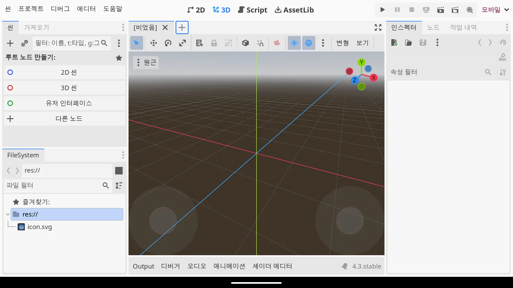

+++
title = '7 Free ways to create Games using only Android'
description = "Create game using only android."
summary = "No code, JS, Lua, Linux"
date = 2025-03-03
# lastmod = 2025-03-11
tags = ["android", "game", "memo"]
coverImg = "blog/250303-game-android/icons.webp"
# externalUrl = "https://www.example.com" # Redirect
draft = false
showDate = true
showReadingTime = true
showToC = true
showComments = true
+++


I roughly sorted them by difficulty. The further down, the harder it gets.


---

## 1. [Castle.xyz](https://castle.xyz/) [No code]



- Play Games: <https://castle.xyz/explore>
- Tutorial: <https://wiki.castle.xyz/Guides%3ACastle_Academy>
- Publish to: Web

[Play store](https://play.google.com/store/apps/details?id=xyz.castle)


---

## 2. [GDevelop](https://gdevelop.io/) [No code]




- Play Games: <https://gd.games/>
- Tutorial: <https://gdevelop.io/academy>
- Publish to: Android, Desktop, (Paid version: Web, iOS)
- Pricing: <https://gdevelop.io/pricing>

[Play store](https://play.google.com/store/apps/details?id=io.gdevelop.ide)


---

## 3. [microStudio](https://microstudio.dev/) [MicroScript]




- Play Games: <https://microstudio.dev/explore/>
- Tutorial: <https://microstudio.dev/tutorials/>
- Publish to: Web, (beta: Windows, MacOS, Linux, Android, iOS)

MicroScript is based on Lua. microStudio also support Python, JavaScript, Lua. 

microStudio is web base game engine. You don't need to install any app. Just click <https://microstudio.dev/projects/>


---

## 4. [Phaser](https://phaser.io/) [JavaScript]




- Find Games: <https://phaser.io/news/category/game>
- Tutorial: <https://phaser.io/learn>
- Libraries: [Awesome Phaser](https://github.com/Raiper34/awesome-phaser)
- Publish to: Web

There is a paid version, but we don't really need it.


### Require

1. JavaScript knowledge 
2. Code editor app that supports local hosting 

> I recommend [spck editor](https://play.google.com/store/apps/details?id=io.spck). It support github!


### Download

Visit <https://phaser.io/download/stable> and download `phaser.min.js` or `phaser.js`. 

Or just add single line on your `html`, inside `<head>`

```html
<script src=" https://cdn.jsdelivr.net/npm/phaser@3.88.2/dist/phaser.min.js "></script>
```

### Getting started

1. Open your code editor app
2. Create new directory 
3. Create `index.html`
4. Visit [Getting started](https://phaser.io/tutorials/getting-started-phaser3/part5), and copy sample code
5. Paste code on your `index.html`
6. Local hosting!


---

## 5. [Löve/Love2D](https://www.love2d.org/) [Lua]




- Find games: <https://www.love2d.org/wiki/Category:Games>
- Tutorial: <https://www.love2d.org/wiki/Category:Tutorials>
- Libraries: [Awesome Love2D](https://github.com/love2d-community/awesome-love2d)
- Publish to: Android, iOS, Windows, MacOS, Linux


### Require

- Lua 5.1 knowledge 
- File manager app
- Code eidtor app

> I recommend [NMM](https://play.google.com/store/apps/details?id=in.mfile) file manager. It support code editing, http server, ftp server and many things. 


### Getting started 

1. Visit <https://www.love2d.org/>, click 'Other downloads - Android APK'
2. Install Löve app
3. Open code editor, and create new directory
4. Create `main.lua`
5. Copy below code and paste on your `main.lua`

```lua
function love.draw()
    love.graphics.print("Hello World", 400, 300)
end
```

6. Zip `main.lua` (e.g. `game.zip`)
7. Open `Love Loa...` app
8. Select `game.zip`!


### Publish to Web(unofficial)

You can build your love game to html + js. But it has many limitations. 

Visit <https://schellingb.github.io/LoveWebBuilder/>


---

## 6. [Godot](https://godotengine.org/) [GDScript]



- Find games: <https://godotengine.org/showcase/>
- Tutorial: <https://docs.godotengine.org/en/stable/getting_started/introduction/index.html>
- Publish to: Android, iOS, Windows, MacOS, Linux, Console

[Play store](https://play.google.com/store/apps/details?id=org.godotengine.editor.v4)


---

## 7. [Termux](https://termux.dev/en/)

Termux is terminal, not game framework. You can run Linux with Termux. That means you can do anything with Termux. 

Visit <https://f-droid.org/en/packages/com.termux/>, and donwload `Termux`


---

## + Keyboard app

I recommend [Unexpected Keyboard](https://play.google.com/store/apps/details?id=juloo.keyboard2). You can customize every key. 


---

## Conclusion 

I have tablet, keyboard, mouse -> Godot 

I Love challenge -> Löve & Termux

Otherwise -> Phaser